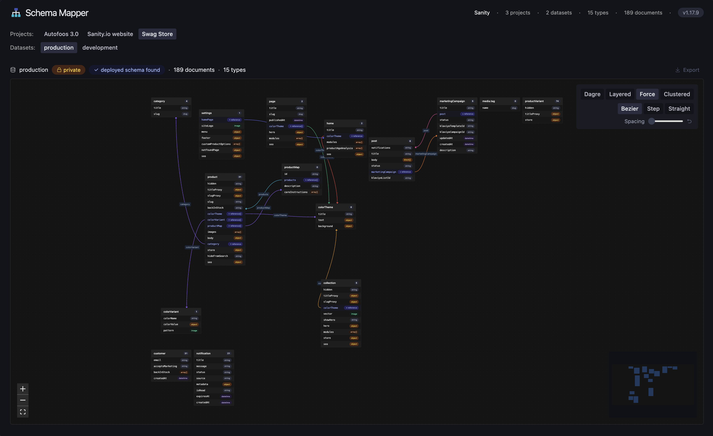

# Schema Mapper

Visual schema explorer for Sanity organizations. Built with [Sanity App SDK](https://www.sanity.io/docs/app-sdk) and [React Flow](https://reactflow.dev/).



Discovers all projects and datasets in your org, renders document types as an interactive node graph with reference edges.

## Features

- **Schema graph** — Document types as nodes, references as colored edges, inline objects as dotted edges
- **Deployed + inferred schemas** — Uses your Studio's deployed schema when available, infers from documents as fallback
- **4 layouts** — Dagre, ELK Layered, Force, Clustered — with per-layout spacing control
- **3 edge styles** — Bezier, Step (rounded corners, sibling offset), Straight — animated transitions
- **Export** — Vector PDF (react-pdf), PNG (3x resolution), SVG — PDF includes structured metadata header with org, project, dataset info
- **Multi-project** — Browse all org projects/datasets via tabs, locked projects shown separately
- **Dark mode** — Follows system preference
- **Version check** — In-app badge shows current version, pulsing dot when updates are available
- **Persistence** — localStorage for settings, hash routing for shareable URLs

## Quick Start

```bash
npx skills add sanity-labs/schema-mapper
```

Then tell your AI agent: *"Set up Schema Mapper"*

Or manually:

```bash
git clone --depth 1 https://github.com/sanity-labs/schema-mapper.git
cd schema-mapper
pnpm install && npx sanity dev
```

You'll need to set a **project ID** in `sanity.cli.ts` and `src/App.tsx`. This can be any project in your org — the App SDK uses it for authentication only. Schema Mapper will discover all projects in your organization automatically.

**Runs inside the Sanity dashboard**, not directly at localhost.

## Updating

The version badge in the app will show a pulsing dot when an update is available. To update, tell your AI agent:

> "Update Schema Mapper"

Or manually:

```bash
cd <schema-mapper-path>
git stash                # saves your config changes
git pull
git stash pop            # restores your project/org IDs
pnpm install
```

> **Note:** `sanity.cli.ts` and `src/App.tsx` contain your project and org IDs. The stash/pop preserves these across updates.

## Permissions

Org member + Project Viewer + dataset read access. No write access needed.

## Deploying

Once you're happy with your configuration, deploy the app to make it available in your org's dashboard:

```bash
cd <schema-mapper-path>
npx sanity deploy
```

You'll be prompted to choose a hostname (e.g. `my-org-schema-mapper`). After deploying, the app will be available to all org members in the Sanity dashboard — no more localhost needed.

## Limitations

- **useDatasets()** — SDK token lacks dataset list permission; falls back to "production"
- **Inferred schema** — Only discovers types with existing documents; field types are approximate
- **Overlapping edges** — Multiple edges to the same target may overlap (step edges are offset, bezier/straight less so)

## Tips

- **Dark mode** — In dev mode, some browsers may not pick up the dashboard's dark mode in the iframe. Right-click the app and reload the iframe. This doesn't happen with deployed apps.

## Tech Stack

Sanity App SDK · React Flow · ELK · Dagre · react-pdf · Sanity UI · Tailwind v4 · React 19 · TypeScript · Vite

## License

MIT
